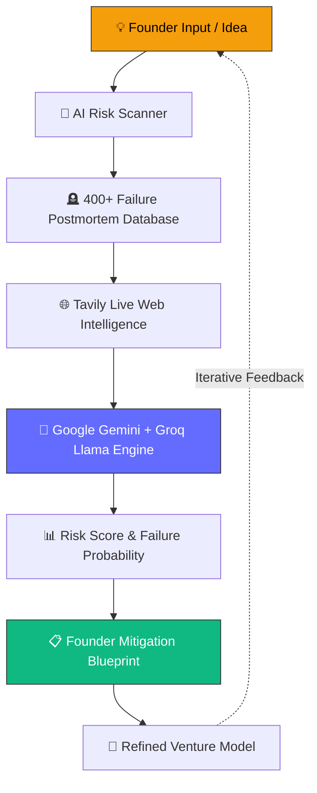

<div align="center">

  <svg xmlns="http://www.w3.org/2000/svg" viewBox="0 0 24 24" width="96" height="96" fill="none" stroke="#f59e0b" stroke-width="1.8" stroke-linecap="round" stroke-linejoin="round">
    <circle cx="12" cy="12" r="1.2" fill="#f59e0b" />
    <path d="M 12 12 C 9.6 7, 9.6 3.2, 12 3.2 C 14.4 3.2, 14.4 7, 12 12 Z" />
    <path d="M 12 12 C 9.6 7, 9.6 3.2, 12 3.2 C 14.4 3.2, 14.4 7, 12 12 Z" transform="rotate(60 12 12)" />
    <path d="M 12 12 C 9.6 7, 9.6 3.2, 12 3.2 C 14.4 3.2, 14.4 7, 12 12 Z" transform="rotate(120 12 12)" />
    <path d="M 12 12 C 9.6 7, 9.6 3.2, 12 3.2 C 14.4 3.2, 14.4 7, 12 12 Z" transform="rotate(180 12 12)" />
    <path d="M 12 12 C 9.6 7, 9.6 3.2, 12 3.2 C 14.4 3.2, 14.4 7, 12 12 Z" transform="rotate(240 12 12)" />
    <path d="M 12 12 C 9.6 7, 9.6 3.2, 12 3.2 C 14.4 3.2, 14.4 7, 12 12 Z" transform="rotate(300 12 12)" />
  </svg>

  # PIVOTVAULT
  ### AI-Powered Startup Intelligence & Failure Analytics Platform

  **_"Learn From Startup History Before You Become Part Of It."_**

  <br/>

  [](https://react.dev)
  [](https://vitejs.dev)
  [](https://tailwindcss.com)
  [](https://nodejs.org)
  [](https://expressjs.com)
  [](https://www.postgresql.org)
  [](https://www.prisma.io)
  [](https://ai.google.dev)
  [](./LICENSE)

  <br/>

  [**Live Demo**](https://pivotvault-forked.vercel.app/) &nbsp;•&nbsp;
  [**Table of Contents**](#-table-of-contents) &nbsp;•&nbsp;
  [**Core Features**](#-core-features) &nbsp;•&nbsp;
  [**Installation**](#%EF%B8%8F-installation) &nbsp;•&nbsp;
  [**API Documentation**](#-api-endpoints)

</div>

<br/>

---

> [!IMPORTANT]
> **PivotVault** is an advanced AI intelligence platform that studies **why startups fail** — not just why they succeed. By indexing over 400+ real postmortems, funding histories, unit economics failures, and market collapses, PivotVault acts as a pre-flight risk detector and decision engine for founders before they build.

<br/>

## 📚 Table of Contents

- [🧠 About PivotVault](#-about-pivotvault)
- [✨ Key Platform Features](#-key-platform-features)
- [🏗️ System Architecture](#%EF%B8%8F-system-architecture)
- [🔄 Data & AI Pipeline Workflow](#-data--ai-pipeline-workflow)
- [🧰 Technology Stack](#-technology-stack)
- [📁 Directory Structure](#-directory-structure)
- [⚙️ Installation & Setup](#%EF%B8%8F-installation--setup)
- [🔐 Environment Configuration](#-environment-configuration)
- [🔌 API Reference](#-api-endpoints)
- [🗺️ Product Roadmap](#%EF%B8%8F-product-roadmap)
- [💼 Vision](#-vision)
- [🤝 Contributing & License](#-contributing--license)

<br/>

---

## 🧠 About PivotVault

90% of startups fail, yet almost every venture tool focuses solely on success stories. The patterns behind startup failure are strikingly repetitive: **unvalidated product-market fit**, **broken unit economics**, **premature scaling**, **co-founder friction**, and **cash burn**.

PivotVault changes the equation by building a structured, searchable, and AI-grounded intelligence layer over the graveyard of startup history.

<table>
<tr>
<td width="50%" valign="top">

### 🪦 1. Historical Intelligence
- **400+ Documented Autopsies**: In-depth Harvard Business Review style case studies (Quibi, Theranos, WeWork, Juicero, Webvan, MoviePass, etc.).
- **Genuine Capital Metrics**: Clean, realistic venture capital funding bounds ($1M – $1.75B).
- **Primary Failure Classification**: Categorized by Unit Economics, Growth Hacks, PMF, Debt, and Governance.

</td>
<td width="50%" valign="top">

### 🤖 2. RAG AI Risk Engine
- **Conversational RAG Assistant**: Grounded responses backed by structured postmortem documents.
- **Pre-Flight AI Risk Scanner**: Multi-dimensional risk score across market demand, business model, and execution.
- **Investor Blueprinting**: Required capital runway, team composition, and mitigation playbooks.

</td>
</tr>
<tr>
<td width="50%" valign="top">

### 🔬 3. Pitch Deck Autopsy
- **Investor-Lens Analysis**: AI tear-down of pitch deck decks identifying weak unit economics, missing moats, and unrealistic TAM.
- **Funding Readiness Score**: Objective valuation and risk feedback.

</td>
<td width="50%" valign="top">

### 🕸️ 4. Interactive Knowledge Graph
- **Node-Link Network**: Interactive visualization connecting founders, investors, failure modes, and successor companies.
- **Community Wisdom**: Anonymous founder confessions and gamified case-study quizzes.

</td>
</tr>
</table>

<br/>

---

## ✨ Key Platform Features

| Module | Feature Name | Description |
| :---: | :--- | :--- |
| 🎯 | **AI Risk Scanner** | Evaluates startup business models and generates a failure-probability score with actionable mitigation strategies and investor blueprints. |
| 🪦 | **Failure Explorer** | Searchable database of 400+ startup postmortems complete with timeline events, failure modes, and genuine capital figures. |
| 💬 | **RAG Assistant** | Conversational AI assistant trained on historical postmortem data and live web search for contextual validation. |
| 🔬 | **Pitch Deck Autopsy** | Teardown engine analyzing pitch decks from an investor's perspective for moat gaps and financial realism. |
| 📋 | **Founder Playbook** | Custom validation milestone checklists, unit economics calculators, and pivot suggestions. |
| ⚔️ | **Competitor Compare** | Side-by-side comparative analysis of market positioning, moat strength, and untapped gaps. |
| 🕸️ | **Knowledge Graph** | Dynamic visual relationship web connecting founders, VC funds, industries, and collapse sequences. |
| 📊 | **Insights Dashboard** | Analytics overview of industry risk scores, failure trend heatmaps, and aggregate capital burn. |
| 🕯️ | **Founder Confessions** | Community-submitted anonymous postmortems, hard-learned lessons, and peer advice. |

<br/>

---

## 🏗️ System Architecture

```
                                  ┌──────────────────────────────────────────┐
                                  │          Client (React 18 App)           │
                                  │  Vite · TailwindCSS · Framer Motion      │
                                  │     D3.js · Recharts · Lucide Icons      │
                                  └────────────────────┬─────────────────────┘
                                                       │ REST API (HTTPS)
                                  ┌────────────────────▼─────────────────────┐
                                  │       API Gateway (Express.js)           │
                                  │    Auth · Validation · CORS · Logger    │
                                  └─────────┬──────────────────────┬─────────┘
                                            │                      │
                   ┌────────────────────────▼───┐          ┌───────▼──────────────────┐
                   │    Prisma ORM & Postgres   │          │     AI & Search Engine    │
                   │  Startups · Users · RAG    │          │  Google Gemini · Groq    │
                   │  Confessions · Playbooks   │          │  Tavily Live Web Search  │
                   └────────────────────────────┘          └──────────────────────────┘
```

<br/>

---

## 🔄 Data & AI Pipeline Workflow



<br/>

---

## 🧰 Technology Stack

- **Frontend**: React 18, Vite 5, Tailwind CSS, Framer Motion, D3.js, Recharts, Lucide Icons
- **Backend**: Node.js, Express.js, Prisma ORM, PostgreSQL
- **AI & RAG**: Google Gemini API, Groq (Llama 3), Tavily Live Search API
- **Authentication & Persistence**: JWT Auth, Firebase Auth Integration, LocalStorage Session Fallbacks
- **Deployment**: Vercel / Netlify (Frontend), Render / Railway (Backend), PostgreSQL Cloud

<br/>

---

## 📁 Directory Structure

```
pivotvault/
├── backend/
│   ├── prisma/
│   │   ├── schema.prisma             # Database schema definition
│   │   ├── seed.js                   # Database seeder script
│   │   └── migrations/               # Prisma migration history
│   ├── src/
│   │   ├── routes/
│   │   │   ├── startups.js           # Startup data endpoints
│   │   │   ├── ai.js                 # Risk scanner & deck autopsy
│   │   │   ├── rag.js                # RAG search & conversational AI
│   │   │   ├── graph.js              # Knowledge graph endpoints
│   │   │   └── founderIntelligence.js# Playbook & comparison APIs
│   │   ├── services/
│   │   │   ├── rag.js                # RAG engine implementation
│   │   │   ├── graph.js              # Graph service
│   │   │   └── founderIntelligence.js
│   │   └── index.js                  # Express backend entry point
│   └── package.json
│
└── frontend/
    ├── public/
    │   └── favicon.svg               # Official 6-Petal PivotVault logo favicon
    ├── src/
    │   ├── components/
    │   │   ├── PivotVaultLogoIcon.jsx# Official 6-Petal SVG brand component
    │   │   ├── Sidebar.jsx           # Responsive dashboard navigation
    │   │   ├── TopBar.jsx            # Global header & search bar
    │   │   └── StartupCard.jsx       # Standardized startup card component
    │   ├── context/
    │   │   ├── AuthContext.jsx       # User auth & profile persistence
    │   │   └── ThemeContext.jsx      # Dark/Light theme manager
    │   ├── pages/
    │   │   ├── LandingPage.jsx       # Interactive root dashboard & hero
    │   │   ├── FailureExplorer.jsx   # Searchable failure database
    │   │   ├── RiskScanner.jsx       # AI Risk Scanner engine
    │   │   ├── PitchDeckAutopsy.jsx  # Pitch deck parser
    │   │   ├── PostmortemPage.jsx    # Documentary case-study viewer
    │   │   ├── KnowledgeGraph.jsx    # Interactive relationship web
    │   │   ├── Login.jsx             # Auth sign-in view
    │   │   └── Signup.jsx            # Auth registration view
    │   ├── App.jsx                   # Primary unified route switcher
    │   └── main.jsx                  # Application mounting entry point
    └── package.json
```

<br/>

---

## ⚙️ Installation & Setup

### Prerequisites

- **Node.js**: `≥ 18.0.0`
- **npm**: `≥ 9.0.0`
- **PostgreSQL**: `≥ 14.0`

### 1️⃣ Clone the Repository

```bash
git clone https://github.com/badgujarkunal93-blip/pivotvault-forked.git
cd pivotvault-forked
```

### 2️⃣ Backend Setup

```bash
cd backend

# Install dependencies
npm install

# Configure environment variables
cp .env.example .env

# Run database migrations
npx prisma migrate dev

# Seed database
npx prisma db seed

# Start development server
npm run dev
```

### 3️⃣ Frontend Setup

```bash
cd ../frontend

# Install dependencies
npm install

# Start Vite dev server
npm run dev
```

The application will be available at `http://localhost:5173`.

<br/>

---

## 🔐 Environment Configuration

Create a `.env` file in the `backend/` directory:

| Key | Description | Required |
| :--- | :--- | :---: |
| `DATABASE_URL` | PostgreSQL connection URL string | ✅ |
| `GEMINI_API_KEY` | Google Gemini AI API Key | ✅ |
| `GROQ_API_KEY` | Groq Llama AI API Key | ✅ |
| `TAVILY_API_KEY` | Tavily Live Web Search API Key | ✅ |
| `PORT` | Backend server port (Default: `4000`) | ❌ |
| `CORS_ORIGIN` | Allowed client origin (e.g., `http://localhost:5173`) | ✅ |

<br/>

---

## 🔌 API Endpoints

<details>
<summary><strong>🪦 Startups — <code>/api/startups</code></strong></summary>

| Method | Route | Description |
| :--- | :--- | :--- |
| `GET` | `/api/startups` | List all tracked startups (search, filter by industry/failure mode) |
| `GET` | `/api/startups/:slug` | Retrieve full postmortem, timeline events, and case study |
| `GET` | `/api/startups/:slug/timeline` | Get detailed chronological shutdown timeline |

</details>

<details>
<summary><strong>🤖 AI & Risk Engine — <code>/api/ai</code></strong></summary>

| Method | Route | Description |
| :--- | :--- | :--- |
| `POST` | `/api/ai/risk-scan` | Submit startup parameters for multi-factor risk analysis |
| `POST` | `/api/ai/pitch-autopsy` | Upload pitch deck content for investor teardown |

</details>

<details>
<summary><strong>💬 RAG Assistant — <code>/api/rag</code></strong></summary>

| Method | Route | Description |
| :--- | :--- | :--- |
| `POST` | `/api/rag/query` | Submit natural language query to the RAG knowledge service |
| `GET` | `/api/rag/history/:sessionId` | Retrieve chat session history |

</details>

<details>
<summary><strong>🕸️ Knowledge Graph — <code>/api/graph</code></strong></summary>

| Method | Route | Description |
| :--- | :--- | :--- |
| `GET` | `/api/graph` | Fetch graph nodes and edges for visual rendering |
| `GET` | `/api/graph/:nodeId/relations` | Get connected entities for a specific startup or founder |

</details>

<br/>

---

## 🗺️ Product Roadmap

- [x] Unified React App Shell with 6-Petal Branding & Favicon
- [x] RAG-Powered Conversational Assistant
- [x] AI Risk Scanner with 38% AI Code Optimizer Preset
- [x] Pitch Deck Autopsy Teardown Engine
- [x] Clean USD Capital Formatting & Realistic Venture Funding Ranges
- [x] User Profile LocalStorage Persistence Across Views
- [ ] Multi-tenant Investor Workspace Dashboard
- [ ] Autonomous Venture Failure Forecasting Model
- [ ] Browser Extension for Live Pitch Deck Analysis

<br/>

---

## 💼 Vision

> *"The Bloomberg Terminal for Startup Failure Intelligence."*

PivotVault’s mission is to give every founder, investor, and operator real-time pattern recognition from historical startup data before critical capital is deployed. By transforming thousands of painful failures into structured intelligence, PivotVault helps the next generation of builders avoid known pitfalls and build enduring companies.

<br/>

---

## 🤝 Contributing & License

Contributions, issues, and feature requests are welcome!

1. Fork the Project
2. Create your Feature Branch (`git checkout -b feature/AmazingFeature`)
3. Commit your Changes (`git commit -m 'Add some AmazingFeature'`)
4. Push to the Branch (`git push origin feature/AmazingFeature`)
5. Open a Pull Request

Distributed under the **MIT License**. See [`LICENSE`](./LICENSE) for more information.

<br/>

<div align="center">

**Built for founders who'd rather learn from someone else's graveyard than build their own.**

⭐ If PivotVault helped you validate your startup idea, please consider starring the repository!

</div>