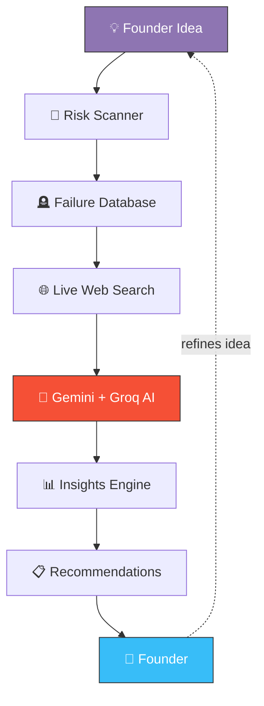

<div align="center">

```
██████╗ ██╗██╗   ██╗ ██████╗ ████████╗██╗   ██╗ █████╗ ██╗   ██╗██╗  ████████╗
██╔══██╗██║██║   ██║██╔═══██╗╚══██╔══╝██║   ██║██╔══██╗██║   ██║██║  ╚══██╔══╝
██████╔╝██║██║   ██║██║   ██║   ██║   ██║   ██║███████║██║   ██║██║     ██║
██╔═══╝ ██║╚██╗ ██╔╝██║   ██║   ██║   ╚██╗ ██╔╝██╔══██║██║   ██║██║     ██║
██║     ██║ ╚████╔╝ ╚██████╔╝   ██║    ╚████╔╝ ██║  ██║╚██████╔╝███████╗██║
╚═╝     ╚═╝  ╚═══╝   ╚═════╝    ╚═╝     ╚═══╝  ╚═╝  ╚═╝ ╚═════╝ ╚══════╝╚═╝
```

### Startup Failure Intelligence Platform

**_"The GitHub of Failed Startups."_**

<br/>

[](https://react.dev)
[](https://vitejs.dev)
[](https://tailwindcss.com)
[](https://nodejs.org)
[](https://expressjs.com)
[](https://www.postgresql.org)
[](https://www.prisma.io)
[](https://ai.google.dev)
[](https://groq.com)
[](./LICENSE)

[](https://github.com/pivotvault/pivotvault/stargazers)
[](https://github.com/pivotvault/pivotvault/network/members)
[](https://github.com/pivotvault/pivotvault/issues)
[](./CONTRIBUTING.md)

<br/>

[**Explore the Docs »**](#-table-of-contents) &nbsp;•&nbsp;
[**View Demo**](#) &nbsp;•&nbsp;
[**Report a Bug**](#) &nbsp;•&nbsp;
[**Request a Feature**](#)

</div>

<br/>

<div align="center">

# ████████████                
           ██████████████████████           
        ████████████████████████████        
      ████████████████████████████████      
    ████████████████████████████████████    
   ██████████████████████████████████████   
  ███████      ██████████████      ███████  
  ███████      ██████████████      ███████  
  ███████      ██████████████      ███████  
  ██████████████████    ██████████████████  
   ████████████████      ████████████████   
    ████████████████████████████████████    
      ████████████████████████████████      
        ████    ████    ████    ████        
        ████    ████    ████    ████        
          ████   ████   ████   ███          
            ████   ████   ██████

**Our skull isn't about death — it's about wisdom.**
It stands for the graveyard of ideas we study so yours doesn't end up there.

</div>

<br/>

> [!TIP]
> **PivotVault** is an AI-powered startup intelligence platform that studies **why startups fail** — not just why they succeed — and turns that history into a decision-making engine for founders who want to validate before they build.

<br/>

## 📚 Table of Contents

<details open>
<summary><strong>Click to expand / collapse</strong></summary>

- [🧠 About PivotVault](#-about-pivotvault)
- [✨ Core Features](#-core-features)
- [🖼️ Screenshots](#️-screenshots)
- [🏗️ Architecture](#️-architecture)
- [🔄 Workflow](#-workflow)
- [🧰 Technology Stack](#-technology-stack)
- [📁 Project Structure](#-project-structure)
- [⚙️ Installation](#️-installation)
- [🔐 Environment Variables](#-environment-variables)
- [🔌 API Endpoints](#-api-endpoints)
- [🗺️ Roadmap](#️-roadmap)
- [💼 Business Vision](#-business-vision)
- [🤝 Contributing](#-contributing)
- [📄 License](#-license)
- [🙏 Acknowledgements](#-acknowledgements)

</details>

<br/>

---

## 🧠 About PivotVault

> *"Learn from thousands of failed founders before becoming one."*

Most of the startup world is obsessed with studying **success**. PivotVault flips that lens.

We built PivotVault around a simple, uncomfortable truth: **90% of startups fail**, and the patterns behind those failures repeat constantly — bad market timing, no real validation, co-founder conflict, running out of runway, building something nobody asked for. Yet almost no tooling exists to help founders *see those patterns before they live them.*

PivotVault combines:

<table>
<tr>
<td width="50%" valign="top">

**📖 Historical Intelligence**
- Thousands of documented startup postmortems
- Structured shutdown reasons & timelines
- Funding history & founder data

</td>
<td width="50%" valign="top">

**🤖 AI Reasoning**
- Conversational assistant powered by RAG
- Idea-level risk scanning
- Pitch deck analysis from an investor's lens

</td>
</tr>
<tr>
<td width="50%" valign="top">

**🌐 Live Market Intelligence**
- Real-time competitor discovery
- Market gap & moat analysis
- Web-grounded recommendations

</td>
<td width="50%" valign="top">

**🕸️ Founder Wisdom**
- Anonymous founder confessions
- Interactive failure case studies
- A living knowledge graph of the startup world

</td>
</tr>
</table>

<br/>

## ✨ Core Features

<table>
<tr>
<th align="left" width="60">#</th>
<th align="left">Feature</th>
<th align="left">What it does</th>
</tr>
<tr>
<td>00</td>
<td><strong>🏠 Isolated Landing Page</strong></td>
<td>An isolated, pixel-perfect Apple-inspired SaaS showcase page (/) that hosts high-fidelity mockups of features, suggested questions, timelines, and relationships, routing seamlessly into the application.</td>
</tr>
<tr>
<td>01</td>
<td><strong>🪦 Failure Explorer</strong></td>
<td>Search historical startup failures — postmortems, timelines, funding history, founders, and the exact reasons each company shut down.</td>
</tr>
<tr>
<td>02</td>
<td><strong>💬 AI Startup Assistant</strong></td>
<td>A conversational, RAG-powered assistant that answers questions like <em>"Why did WeWork fail?"</em> or <em>"How should I validate my SaaS idea?"</em></td>
</tr>
<tr>
<td>03</td>
<td><strong>🎯 AI Risk Scanner</strong></td>
<td>Feed in a startup idea and get a failure-probability score across market validation, business model, competition, and execution risk.</td>
</tr>
<tr>
<td>04</td>
<td><strong>📋 Founder Playbook</strong></td>
<td>Generates actionable validation checklists, milestones, and pivot suggestions using both historical failures and live web search.</td>
</tr>
<tr>
<td>05</td>
<td><strong>🔬 Pitch Deck Autopsy</strong></td>
<td>Upload a PPT/PDF pitch deck and get an AI teardown from an investor's perspective — weaknesses, missing information, funding readiness.</td>
</tr>
<tr>
<td>06</td>
<td><strong>⚔️ Competitor Compare</strong></td>
<td>Live analysis of current competitors, differentiation angles, moat strength, and untapped market gaps.</td>
</tr>
<tr>
<td>07</td>
<td><strong>🕸️ Startup Graph</strong></td>
<td>An interactive knowledge graph connecting founders, investors, acquisitions, industries, failures, and successor companies.</td>
</tr>
<tr>
<td>08</td>
<td><strong>📊 Insights Dashboard</strong></td>
<td>Failure trends, industry breakdowns, funding statistics, heatmaps, and charts — the analytics layer of the platform.</td>
</tr>
<tr>
<td>09</td>
<td><strong>🕯️ Founder Confessions</strong></td>
<td>Anonymous, honest stories from real founders — mistakes, lessons, and community-sourced wisdom.</td>
</tr>
<tr>
<td>10</td>
<td><strong>🧩 Failure Quiz</strong></td>
<td>An interactive, gamified way to learn from real startup case studies.</td>
</tr>
</table>

<br/>

## 🖼️ Screenshots

<div align="center">

<table>
<tr>
<td align="center" width="33%">
<em>Failure Explorer</em><br/>
<code>/screenshots/failure-explorer.png</code>
</td>
<td align="center" width="33%">
<em>Risk Scanner</em><br/>
<code>/screenshots/risk-scanner.png</code>
</td>
<td align="center" width="33%">
<em>Insights Dashboard</em><br/>
<code>/screenshots/dashboard.png</code>
</td>
</tr>
</table>

</div>

> [!NOTE]
> Drop your own screenshots or screen recordings into `/screenshots` and swap in the image links above (``) once the UI is ready to showcase.

<br/>

## 🏗️ Architecture

```
                          ┌──────────────────────────────┐
                          │         Client (React)        │
                          │  Vite · Tailwind · Framer     │
                          │     D3.js · Recharts          │
                          └───────────────┬───────────────┘
                                          │ REST / HTTPS
                          ┌───────────────▼───────────────┐
                          │     API Layer (Express.js)     │
                          │  Auth · Routing · Validation   │
                          └───────┬───────────────┬────────┘
                                  │               │
                  ┌───────────────▼───┐   ┌───────▼────────────┐
                  │   Prisma ORM       │   │     AI Layer        │
                  │   PostgreSQL       │   │ Gemini · Groq/Llama │
                  │ Failures · Users   │   │   Tavily Search      │
                  └────────────────────┘   └─────────────────────┘
```

<br/>

## 🔄 Workflow



<br/>

## 🧰 Technology Stack

<table>
<tr>
<td valign="top" width="25%">

**Frontend**

- React 18
- Vite
- Tailwind CSS
- Framer Motion
- D3.js
- Recharts
- Lucide React

</td>
<td valign="top" width="25%">

**Backend**

- Node.js
- Express.js
- PostgreSQL
- Prisma ORM
- REST APIs

</td>
<td valign="top" width="25%">

**AI Layer**

- Google Gemini
- Groq (Llama)
- Tavily Search

</td>
<td valign="top" width="25%">

**Deployment**

- Netlify (Frontend)
- Render (Backend)
- PostgreSQL (Database)
- GitHub (Version Control)

</td>
</tr>
</table>

<br/>

## 📁 Project Structure

```
pivotvault/
├── backend/
│   ├── prisma/
│   │   ├── schema.prisma            # Prisma DB schema
│   │   ├── seed.js                  # Initial DB data
│   │   └── migrations/              # DB migration history
│   ├── src/
│   │   ├── routes/
│   │   │   ├── startups.js
│   │   │   ├── ai.js
│   │   │   ├── graph.js
│   │   │   ├── rag.js
│   │   │   ├── founderIntelligence.js
│   │   │   └── ...
│   │   ├── services/
│   │   │   ├── rag.js
│   │   │   ├── graph.js
│   │   │   ├── founderIntelligence.js
│   │   │   └── extraction/
│   │   │       ├── KnowledgeExtractor.js
│   │   │       └── ...
│   │   ├── pipeline/
│   │   │   ├── queues.js            # Agent job queues
│   │   │   ├── workers.js           # 8 specialized agents
│   │   │   ├── scheduler.js         # Recurring job scheduler
│   │   │   └── sources/
│   │   ├── middleware/
│   │   └── index.js                 # Server entry
│   └── package.json
│
└── frontend/
    ├── public/
    │   └── landing.html             # Style-isolated public landing page
    ├── src/
    │   ├── pages/
    │   │   ├── NewLandingPage.jsx   # Isolated landing page wrapper
    │   │   ├── AiAssistant.jsx
    │   │   ├── RiskScanner.jsx
    │   │   ├── FounderPlaybook.jsx
    │   │   ├── PitchDeckAutopsy.jsx
    │   │   ├── KnowledgeGraph.jsx
    │   │   └── ...
    │   ├── components/
    │   ├── context/
    │   └── main.jsx
    └── package.json
```

<br/>

## ⚙️ Installation

### Prerequisites

| Requirement | Version |
|---|---|
| Node.js | ≥ 18.x |
| PostgreSQL | ≥ 14.x |
| npm | ≥ 9.x |

### 1️⃣ Clone the repository

```bash
git clone https://github.com/pivotvault/pivotvault.git
cd pivotvault
```

<details>
<summary><strong>2️⃣ Backend Setup</strong></summary>

```bash
cd backend

# Install dependencies
npm install

# Configure environment variables
cp .env.example .env

# Run Prisma migrations
npx prisma migrate dev

# Seed the database with historical failure data
npx prisma db seed

# Start the backend
npm run dev
```

</details>

<details>
<summary><strong>3️⃣ Frontend Setup</strong></summary>

```bash
cd frontend

# Install dependencies
npm install

# Start the dev server
npm run dev
```

</details>

> [!IMPORTANT]
> Make sure your backend is running on the port referenced by the frontend's `VITE_API_URL` before starting the client.

<br/>

## 🔐 Environment Variables

Create a `.env` file inside `backend` with the following:

| Variable | Description | Required |
|---|---|:---:|
| `DATABASE_URL` | PostgreSQL connection string | ✅ |
| `GEMINI_API_KEY` | Google Gemini API key | ✅ |
| `GROQ_API_KEY` | Groq (Llama) API key | ✅ |
| `TAVILY_API_KEY` | Tavily live web search API key | ✅ |
| `CORS_ORIGIN` | Allowed frontend origin | ✅ |
| `NODE_ENV` | `development` \| `production` | ✅ |

<br/>

## 🔌 API Endpoints

<details>
<summary><strong>🪦 Startups — <code>routes/startups.js</code></strong></summary>

| Method | Endpoint | Description |
|---|---|---|
| `GET` | `/api/startups` | List all tracked startups (paginated, filterable) |
| `GET` | `/api/startups/:id` | Get a single startup's full postmortem |
| `GET` | `/api/startups/:id/timeline` | Get the shutdown/funding timeline for a company |

</details>

<details>
<summary><strong>🤖 AI — <code>routes/ai.js</code></strong></summary>

| Method | Endpoint | Description |
|---|---|---|
| `POST` | `/api/ai/risk-scan` | Submit an idea and receive an AI-generated risk report |
| `POST` | `/api/ai/pitch-autopsy` | Upload a PPT/PDF deck for an investor-lens teardown |

</details>

<details>
<summary><strong>💬 RAG — <code>routes/rag.js</code></strong></summary>

| Method | Endpoint | Description |
|---|---|---|
| `POST` | `/api/rag/query` | Ask the RAG-powered assistant a startup question |
| `GET` | `/api/rag/history/:sessionId` | Retrieve a chat session's history |

</details>

<details>
<summary><strong>🕸️ Graph — <code>routes/graph.js</code></strong></summary>

| Method | Endpoint | Description |
|---|---|---|
| `GET` | `/api/graph` | Fetch the interactive startup knowledge graph |
| `GET` | `/api/graph/:nodeId/relations` | Get relationships for a founder, investor, or startup node |

</details>

<details>
<summary><strong>🧭 Founder Intelligence — <code>routes/founderIntelligence.js</code></strong></summary>

| Method | Endpoint | Description |
|---|---|---|
| `POST` | `/api/founder-intelligence/playbook` | Generate a founder validation checklist & pivot suggestions |
| `POST` | `/api/founder-intelligence/compare` | Run live competitor & market-gap analysis |

</details>

<br/>

> [!NOTE]
> Behind these routes sits an agent **pipeline** (`pipeline/workers.js`) of 8 specialized agents, coordinated through job queues (`pipeline/queues.js`) and a recurring scheduler (`pipeline/scheduler.js`) that keeps failure data and market intelligence fresh from live sources.

## 🗺️ Roadmap

- [x] Failure Explorer
- [x] AI Startup Assistant
- [x] AI Risk Scanner
- [x] Founder Playbook
- [x] Pitch Deck Autopsy
- [ ] Authentication & founder profiles
- [ ] Investor dashboard
- [ ] Funding prediction AI
- [ ] YC startup matching
- [ ] Failure forecasting models
- [ ] Mobile app
- [ ] Chrome extension
- [ ] Public API platform
- [ ] Community marketplace
- [ ] Startup benchmarking
- [ ] Founder networking
- [ ] AI long-term memory
- [ ] Autonomous startup advisor

<br/>

## 💼 Business Vision

> *"The Bloomberg Terminal for Startup Intelligence."*

PivotVault's long-term vision is to become the default place founders go **before** they build — a terminal where every idea can be checked against the largest structured dataset of startup failures in the world, cross-referenced with live market signals.

Where Bloomberg gives traders real-time financial intelligence, PivotVault aims to give founders real-time **failure intelligence** — turning historical pattern-recognition into a genuine competitive advantage for the next generation of builders.

<br/>

## 🤝 Contributing

Contributions are what make the open-source community an incredible place to learn, build, and grow. Any contribution you make is **greatly appreciated**.

1. Fork the repository
2. Create your feature branch (`git checkout -b feature/amazing-feature`)
3. Commit your changes (`git commit -m 'Add some amazing feature'`)
4. Push to the branch (`git push origin feature/amazing-feature`)
5. Open a Pull Request

Please read [`CONTRIBUTING.md`](./CONTRIBUTING.md) for our code of conduct and PR process.

<br/>

## 📄 License

Distributed under the **MIT License**. See [`LICENSE`](./LICENSE) for more information.

<br/>

## 🙏 Acknowledgements

- Every founder who shared their failure so others could learn from it
- The open-source community behind React, Prisma, and the rest of this stack
- Google Gemini, Groq, and Tavily for making the AI layer possible

<br/>

<div align="center">

**Built for founders who'd rather learn from someone else's graveyard than build their own.**

⭐ If PivotVault helped you think differently about your idea, consider starring the repo.

</div>